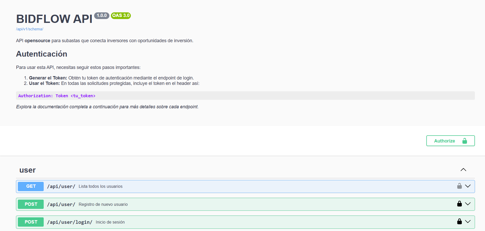
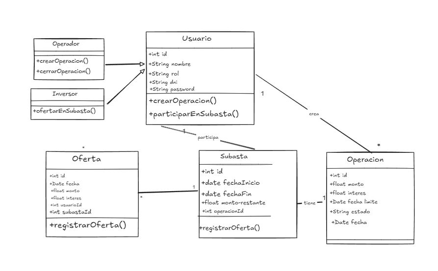

# BIDFLOW Public API

BIDFLOW es una API opensource para subastas que conecta a inversores con oportunidades de inversión.

## Descripción

BIDFLOW utiliza Django Rest Framework para proporcionar una API básica que facilita la gestión de subastas y ofertas de inversores.

## Se asumió:

- Un inversor y un operador son roles excluyentes (se debe crear un perfil por separado para cada funcionalidad).
- Zona horario UTC
- Moneda: Dolares
- Una operación tiene un monto inicial, pero puede tener cero o _n_ inversores.
- Una subasta tiene un campo denominado "monto restante" (para visualizar el valor disponible de la operación).
- La creación de una inversión será rechazada si el porcentaje de interés esperado es mayor al porcentaje de la oferta.
- La creación de una inversión será rechazada si el monto a invertir es mayor al disponible (se asume que el inversor desea invertir el monto total disponible en automatico si no le resulta atractivo).

## Requisitos previos

- Python 3.11+
- Docker y Docker Compose

## Instalación

1. Clonar el repositorio:

   ```
   git clone https://github.com/tu-usuario/bidflow-api.git
   cd bidflow-api
   ```

2. Construir y levantar los contenedores:

   ```
   docker compose up --build
   ```

   Testing

   ```
   docker compose up --force-recreate tests

   ```

   Coverage

   ```
   docker compose up --force-recreate tests

   ```

3. La API estará disponible en `http://localhost:9999/api/v1/doc/`
   

## Uso

Para utilizar la API, puedes hacer peticiones HTTP a los diferentes endpoints. Aquí algunos ejemplos:

1. Obtener todas las subastas activas:

   ```
   GET http://localhost:9999/api/auction/
   ```

2. Crear una nueva oferta:

   ```
   POST http://localhost:9999/api/auction/
   Content-Type: application/json

   {
     "auction_id": 1,
     "amount": 1000.00
   }
   ```

Para más detalles sobre los endpoints disponibles y sus parámetros, consulta la documentación de la API.

## Diagrama de Relación

A continuación se muestra un diagrama básico de la relación entre las principales entidades de BIDFLOW:


Este diagrama muestra las relaciones básicas entre Subastas (AUCTION), Ofertas (BID) e Inversores (INVESTOR). Puedes expandir este diagrama para incluir más entidades y relaciones según sea necesario para tu proyecto.

## Contribuir

Si deseas contribuir al proyecto, por favor:

1. Haz un Fork del repositorio
2. Crea una nueva rama (`git checkout -b feature/AmazingFeature`)
3. Haz commit de tus cambios (`git commit -m 'Add some AmazingFeature'`)
4. Push a la rama (`git push origin feature/AmazingFeature`)
5. Abre un Pull Request

## Recursos

- **Cron en Docker**  
  Aprende cómo configurar y utilizar `cron` dentro de contenedores Docker:  
  [Ver video en YouTube](https://youtu.be/JPyV3ela0H8?si=VMTktpIUby2SjNJj)

- **Configuración de Docker para Quitar Errores de Inicio**  
  Solución a errores comunes de inicio en Docker. Consulta el minuto 51 para obtener detalles específicos:  
  [Ver video en YouTube](https://www.youtube.com/live/xB6_db-pbaI)

- **Pruebas en Django con Factory Boy**  
  Guía completa sobre cómo realizar pruebas en Django utilizando `factory_boy`:  
  [Ver video en YouTube](https://www.youtube.com/watch?v=ktuOUaOyMmo&list=PLOLrQ9Pn6cawinBJbH5d9IfloO9RRPMiq&index=31)

- **Documentación de Mistral**  
  Consulta la documentación oficial de la API de Mistral:  
  [Ver documentación](https://docs.mistral.ai/api/)

- **DRF Spectacular**  
  Genera documentación automática para tu API en Django Rest Framework con DRF Spectacular:  
  [Ver documentación](https://drf-spectacular.readthedocs.io/en/latest/)
